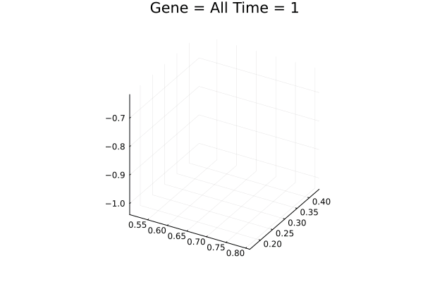
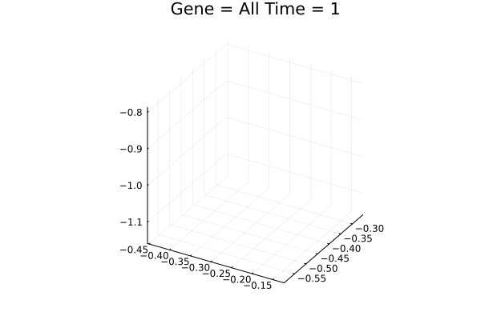
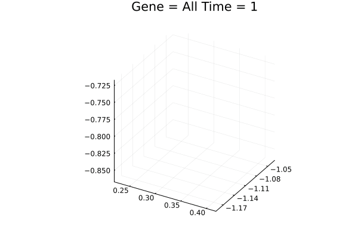
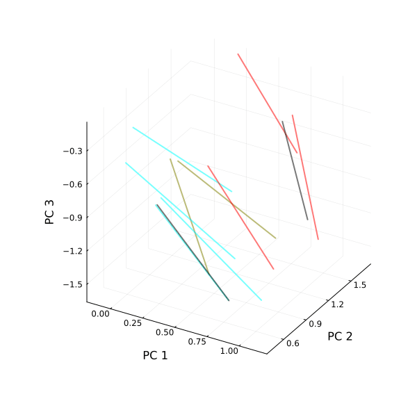
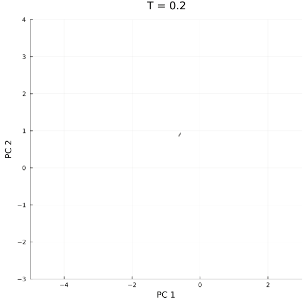

# PAPER

This Github has been made available to share the code and the networks used in the paper: Evolution of robust cell differentiation mechanisms under epigenetic feedback
https://arxiv.org/abs/2503.20651

Here we share some of the animations created during the work to more clearly demonstrate the behaviour of the differentiation types.

## Type A Fig. 3

## Type B Fig. 6

## Type C Limit Cycle Fig. 10

## Type C Saddle Points Fig. 9.a

## Saddle Points Approximation for Fig. 9.b

The exact PCA was not recovered as stochasticity in the system was not seeded in the plot for the paper. Due to this the exact dynamics are slightly altered, but their general behaviour is still the same. Saddle nodes are shown through pink # signs when orbits diverge apart

The code and analysis has been performed by Davey Plugers and is available to contact on:
daveyplugers@gmail.com
davey.plugers@nbi.ku.dk

Networks are given in .jld data which can be read by Julia. These networks consists of the Gene Regulatory Matrix J_ij, the C_i values and the initial position of the network x_i
All further properties and constants are given in the paper.

These are working notebooks, and while I have made copies and cleared them from unneeded code, there is still a lot of redundancy and they are not optimised. There may also be some errors regarding saving, writing and reading of certain path files as I have put them all in this new folder.(Ex. Plot_Cycles usually refers to folders starting with the date 07/01, these have been put in a new subfolder named: "07/01_Earlier_Evolution_Runs")

Outputs of most of these notebooks have been removed except for the usual major output. This has to be done to keep the script sizes under 100Mb

Be aware that networks are simply named after their generation and do not correspond to the same run, if you have a script referring to a network in a given folder that is not present, it is likely not the same network as one of a similar generation in another folder.

Please do not hesitate to contact when there are any questions or issues regarding the code or the analysis that has been performed.